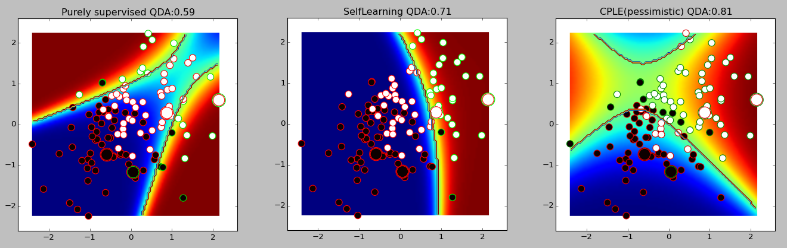
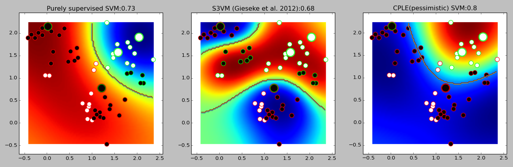
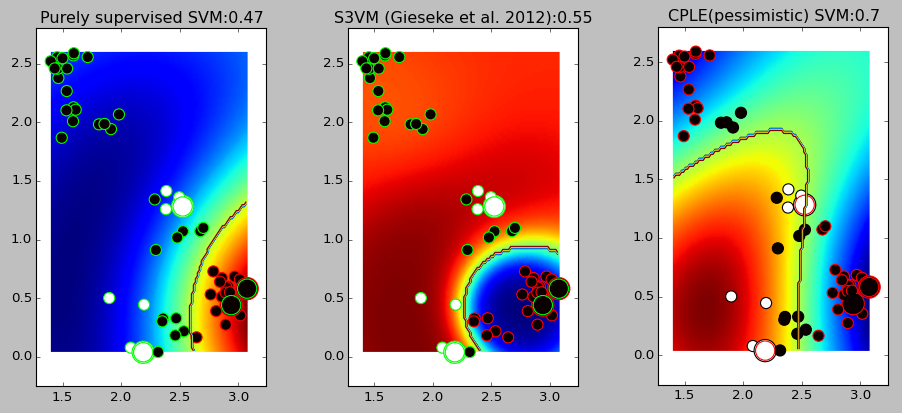
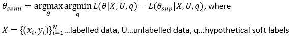
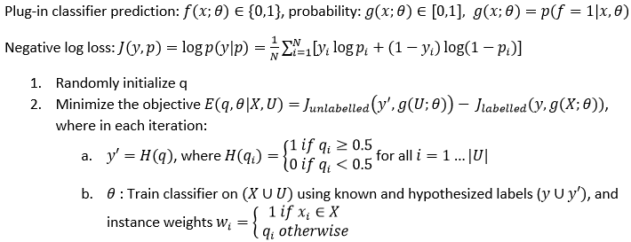

Semi-supervised learning frameworks for Python
===============

This project contains Python implementations for semi-supervised
learning, made compatible with scikit-learn, including

- **Contrastive Pessimistic Likelihood Estimation (CPLE)** (based on - but not equivalent to - [Loog, 2015](http://arxiv.org/abs/1503.00269)), a `safe' framework applicable for all classifiers which can yield prediction probabilities
(safe here means that the model trained on both labelled and unlabelled data should not be worse than models trained only on the labelled data)

- Self learning (self training), a naive semi-supervised learning framework applicable for any classifier (iteratively labelling the unlabelled instances using a trained classifier, and then re-training it on the resulting dataset - see e.g. http://pages.cs.wisc.edu/~jerryzhu/pub/sslicml07.pdf )

- Semi-Supervised Support Vector Machine (S3VM) - a simple scikit-learn compatible wrapper for the QN-S3VM code developed by 
Fabian Gieseke, Antti Airola, Tapio Pahikkala, Oliver Kramer (see http://www.fabiangieseke.de/index.php/code/qns3vm ) 
This method was included for comparison

The first method is a novel extension of [Loog, 2015](http://arxiv.org/abs/1503.00269) for any discriminative classifier (the differences to the original CPLE are explained below). The last two methods are only included for comparison. 

 
The advantages of the CPLE framework compared to other semi-supervised learning approaches include  

- it is a **generally applicable framework (works with scikit-learn classifiers which allow per-sample weights)**

- it needs low memory (as opposed to e.g. Label Spreading which needs O(n^2)), and 

- it makes no additional assumptions except for the ones made by the choice of classifier 

The main disadvantage is high computational complexity. Note: **this is an early stage research project, and work in progress** (it is by no means efficient or well tested)!

If you need faster results, try the Self Learning framework (which is a naive approach but much faster):

```python
from frameworks.SelfLearning import *

any_scikitlearn_classifier = SVC()
ssmodel = SelfLearningModel(any_scikitlearn_classifier)
ssmodel.fit(X, y)
```

Usage
===============

The project requires [scikit-learn](http://scikit-learn.org/stable/install.html), [matplotlib](http://matplotlib.org/users/installing.html) and [NLopt](http://ab-initio.mit.edu/wiki/index.php/NLopt_Installation) to run.

Usage example:

```python
# load `Lung cancer' dataset from mldata.org
cancer = fetch_mldata("Lung cancer (Ontario)")
X = cancer.target.T
ytrue = np.copy(cancer.data).flatten()
ytrue[ytrue>0]=1

# label a few points 
labeled_N = 4
ys = np.array([-1]*len(ytrue)) # -1 denotes unlabeled point
random_labeled_points = random.sample(np.where(ytrue == 0)[0], labeled_N/2)+\
                        random.sample(np.where(ytrue == 1)[0], labeled_N/2)
ys[random_labeled_points] = ytrue[random_labeled_points]

# supervised score
basemodel = SGDClassifier(loss='log', penalty='l1') # scikit logistic regression
basemodel.fit(X[random_labeled_points, :], ys[random_labeled_points])
print "supervised log.reg. score", basemodel.score(X, ytrue)

# fast (but naive, unsafe) self learning framework
ssmodel = SelfLearningModel(basemodel)
ssmodel.fit(X, ys)
print "self-learning log.reg. score", ssmodel.score(X, ytrue)

# semi-supervised score (base model has to be able to take weighted samples)
ssmodel = CPLELearningModel(basemodel)
ssmodel.fit(X, ys)
print "CPLE semi-supervised log.reg. score", ssmodel.score(X, ytrue)

# semi-supervised score, RBF SVM model
ssmodel = CPLELearningModel(sklearn.svm.SVC(kernel="rbf", probability=True), predict_from_probabilities=True) # RBF SVM
ssmodel.fit(X, ys)
print "CPLE semi-supervised RBF SVM score", ssmodel.score(X, ytrue)

# supervised log.reg. score 0.410256410256
# self-learning log.reg. score 0.461538461538
# semi-supervised log.reg. score 0.615384615385
# semi-supervised RBF SVM score 0.769230769231
```


Examples
===============

Two-class classification examples with 56 unlabelled (small circles in the plot) and 4 labelled (large circles in the plot) data points. 
Plot titles show classification accuracies (percentage of data points correctly classified by the model)

In the second example, **the state-of-the-art S3VM performs worse than the purely supervised SVM**, while the CPLE SVM (by means of the 
pessimistic assumption) provides increased accuracy.

Quadratic Discriminant Analysis (from left to right: supervised QDA, Self learning QDA, pessimistic CPLE QDA) 


Support Vector Machine (from left to right: supervised SVM, S3VM [(Gieseke et al., 2012)](http://www.sciencedirect.com/science/article/pii/S0925231213003706), pessimistic CPLE SVM)

 
Support Vector Machine (from left to right: supervised SVM, S3VM [(Gieseke et al., 2012)](http://www.sciencedirect.com/science/article/pii/S0925231213003706), pessimistic CPLE SVM)


Motivation
===============

Current semi-supervised learning approaches require strong assumptions, and perform badly if those 
assumptions are violated (e.g. low density assumption, clustering assumption). In some cases, they can perform worse than a supervised classifier trained only on the labeled exampels. Furthermore, the vast majority require O(N^2) memory.  

[(Loog, 2015)](http://arxiv.org/abs/1503.00269) has suggested an elegant framework (called Contrastive Pessimistic Likelihood Estimation / CPLE) which 
**only uses assumptions intrinsic to the chosen classifier**, and thus allows choosing likelihood-based classifiers which fit the domain / data 
distribution at hand, and can work even if some of the assumptions mentioned above are violated. The idea is to pessimistically assign soft labels 
to the unlabelled data, such that the improvement over the supervised version is minimal (i.e. assume the worst case for the unknown labels).

The parameters in CPLE can be estimated according to:


The original CPLE framework is only applicable to likelihood-based classifiers, and (Loog, 2015) only provides solutions for Linear Discriminant Analysis and the Nearest Mean Classifier.

The CPLE implementation in this project
===============

Building on this idea, this project contains a general semi-supervised learning framework allowing plugging in **any classifier** which allows 1) instance weighting and 2) can generate probability 
estimates (such probability estimates can also be provided by [Platt scaling](https://en.wikipedia.org/wiki/Platt_scaling) for classifiers which don't support them. Also, an experimental feature 
is included to make the approach work with classifiers not supporting instance weighting).

In order to make the approach work with any classifier, the discriminative likelihood (DL) is used instead of the generative likelihood, which is the first major difference to (Loog, 2015). The second 
difference is that only the unlabelled data is included in the first term of the minimization objective (point 2. below), which leads to pessimistic minimization of the DL over the unlabelled data, but maximization
of the DL over the labelled data. (Note that the DL is equivalent to the negative log loss for binary classifiers with probabilistic predictions - see below.) 



The resulting semi-supervised learning framework is highly computationally expensive, but has the advantages of being a generally applicable framework, needing low memory, and making no additional assumptions except for the ones made by the choice of classifier 
